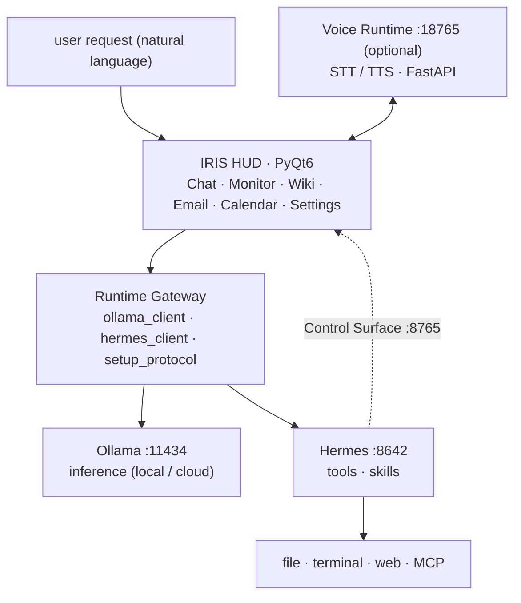

<div align="center">

[🇰🇷 한국어](README.md) · **🇺🇸 English** · [🇯🇵 日本語](README.ja.md) · [🇨🇳 中文](README.zh.md)

</div>

# IRIS

**Open Source Desktop AI Agent Runtime**

IRIS connects LLM, MCP, Voice Runtime, and Local/Cloud Model into an **AI Agent Runtime that runs on your own PC**.
Instead of a paid subscription or manual wiring, a single installer prepares [Ollama](https://ollama.com/) (model inference) and [Hermes Agent](https://hermes-agent.nousresearch.com/) (tools and skills), then binds them into a conversational HUD.

It aims to be more than a chatbot:

- **Agent Runtime** — multi-step request handling
- **Tool Execution** — file, terminal, web
- **MCP Integration** — external tool connectivity
- **Voice Interaction** — STT/TTS as a standalone service
- **Runtime Gateway** — a separated execution boundary

[](LICENSE)
[](https://www.python.org/downloads/)
[](#installation)
[](https://github.com/kwakminoo/Project-IRIS-Light/releases/latest)

> Display name **IRIS** · package name Iris Light · app version `0.1.0-light`

🌐 **Project site — [cjh030906.github.io/iris-light-site](https://cjh030906.github.io/iris-light-site/)** ([repo](https://github.com/cjh030906/iris-light-site))

---

## Demo

**Three minutes from install to a working agent** — the video is not published yet. The recording script and upload steps live in [`docs/demo-video-script.md`](docs/demo-video-script.md).

<!-- DEMO_VIDEO:START -->
<!--
  ⚠ After uploading the video, uncomment the line below and replace VIDEO_ID.
     VIDEO_ID = https://youtu.be/<11 chars>
[](https://youtu.be/VIDEO_ID)
-->
<!-- DEMO_VIDEO:END -->

The four GIFs below are planned recordings. Once a file lands in the folder, just uncomment its line.
Specs (length, resolution, shot order) are in [`assets/demo/README.md`](assets/demo/README.md).

### 1. Agent Execution

```text
user command → IRIS HUD → Agent Runtime → tool execution
```

<!--  -->

### 2. Voice Interaction

```text
STT → UserTurnDispatcher → Agent Runtime → TTS
```

<!--  -->

### 3. Runtime Architecture

```text
GUI → Runtime Gateway → Hermes → Ollama
```

<!--  -->

### 4. Installation

```text
IRIS-Setup.exe → automatic venv & package install → setup wizard
```

<!--  -->

---

## Why IRIS?

Most AI assistants are tied to one vendor, or stop at a chat interface.
Local models have the opposite problem: they stop at "running a model", and getting them to actually write code, edit documents, and touch files on your machine takes a lot of manual integration.

IRIS narrows that gap:

| Problem | How IRIS solves it |
|------|------|
| Locked into one vendor | Pick and connect Ollama or any OpenAI-compatible provider |
| Agent logic tangled into the UI | Execution boundary separated as a Runtime Gateway |
| Unusable without a GPU | Cloud models by default, local models optional |
| Voice bolted onto the app | Voice Runtime runs as a separate FastAPI service (`:18765`) |
| Hard to extend with tools | Extend through Hermes skills and MCP |
| Complex install and wiring | The installer handles Python, venv, packages, and runtimes |

IRIS does not reimplement web search, shell, or file IO.
It owns **sessions, permissions, streaming UI, and the setup protocol**, and delegates execution to Ollama/Hermes.

<details>
<summary><b>Project background</b></summary>

- **Accessibility** — lowers the barrier for students and junior developers who cannot absorb subscription fees or complex agent setup.
- **Hands-on AI** — beyond consuming answers, the agent performs coding, document, and file work directly on the local PC.
- **Reducing the gap** — connects a model that fits the machine you already have, so hardware and budget matter less.
- **Privacy and independence** — local execution reduces how much sensitive data leaves the machine, and avoids depending on a single vendor.

</details>

---

## Features

| Feature | Description |
|---|---|
| **LLM Agent** | Multi-step tool calls through Hermes (file, terminal, web) |
| **MCP** | `iris-control` stdio MCP · Hermes MCP integration |
| **Voice Runtime** | STT/TTS split out into a FastAPI service (`:18765`, optional install) |
| **Runtime Gateway** | Execution boundary owning sessions, permissions, streaming |
| **Local Model** | Ollama local models (`:11434`) |
| **Cloud Model** | OpenAI-compatible providers for machines without a GPU |
| **Setup protocol** | First run automates Ollama, model pull, Hermes, provider, gateway, MCP step by step |
| **Conversational HUD** | Model picker, history, thought/tool logs, live streaming |
| **Control Surface** | Hermes → UI reverse control (`:8765`) · `iris-control` skills |
| **Workspaces** | System monitor · email (multi-account) · calendar · IDE Companion · Iris Wiki |
| **Local storage** | SQLite for settings and profiles (`~/.iris-light/`) |
| **Optional extensions** | Screen learning (Aloha) · Android emulator · mobile-mcp |

In progress: Instagram / Discord / Kakao / Telegram workspaces.

---

## Architecture



Full-resolution diagram: [`docs/ia/iris-system-architecture.png`](docs/ia/iris-system-architecture.png)
Design docs: [domain & Runtime Gateway](docs/domain.md) · [information architecture & request paths](docs/ia/IA.md)

---

## Quick Start

**No command line required, even if you have never used Python.**

<table>
<tr><td align="center"><b>1</b></td><td><a href="https://github.com/kwakminoo/Project-IRIS-Light/releases/latest/download/IRIS-Setup.exe"><b>Download IRIS-Setup.exe</b></a> — Windows 10/11 · ~23MB</td></tr>
<tr><td align="center"><b>2</b></td><td><b>Run it.</b> There is no code-signing certificate, so Windows blocks it once — <b>More info → Run anyway</b>. Python detection, venv, package install, and verification are <b>fully automatic</b> and take a few minutes.</td></tr>
<tr><td align="center"><b>3</b></td><td>Launch <b><code>IRIS</code></b> from the desktop. The setup wizard continues with Ollama and Hermes.</td></tr>
</table>

### First run

1. The app opens the **setup wizard**.
2. Core steps: install and start Ollama → pull a minimal model → install Hermes → connect API/provider → start the gateway.
3. Optional steps (STT voice, full TTS, Aloha screen learning, emulator, Node/mobile-mcp, cloud login) can be installed now or later.
4. Send a natural-language request in the HUD chat; Hermes/Ollama stream the response and tool execution.

> UI-only demo: `IRIS_SETUP_DEMO=1` (no real install) · dry run: `IRIS_SETUP_DRY_RUN=1`

---

## Installation

### Option A — Installer (recommended)

Download and run [**IRIS-Setup.exe**](https://github.com/kwakminoo/Project-IRIS-Light/releases/latest/download/IRIS-Setup.exe).
It installs to `%LOCALAPPDATA%\Programs\IRIS`, then runs the same `setup.ps1` as Option B to prepare the venv and packages.

- Windows SmartScreen warns once because the binary is unsigned — **More info → Run anyway**
- Downloading packages takes a few minutes. Logs go to `setup-log.txt` and `setup-log-pip.txt` in the install folder
- If the install is interrupted, run `setup.bat` in the install folder again to resume

### Option B — Automatic install from source

**Double-click `setup.bat`** in the repository folder. No terminal, no commands to memorize.

```powershell
.\setup.ps1              # default install
.\setup.ps1 -Run         # install, then launch
.\setup.ps1 -Voice       # also install the optional voice runtime (.venv-voice)
.\setup.ps1 -Recreate    # delete and rebuild .venv (when the install got tangled)
```

Linux / macOS:

```bash
chmod +x setup.sh
./setup.sh               # supports --run / --recreate
```

> `setup.bat` still works where `ExecutionPolicy` blocks `.ps1` files; it internally uses `-ExecutionPolicy Bypass`.

### Option C — Manual install

```powershell
git clone https://github.com/kwakminoo/Project-IRIS-Light.git
cd Project-IRIS-Light

python -m venv .venv
.\.venv\Scripts\Activate.ps1
pip install -r requirements.txt
copy .env.example .env
```

<details>
<summary><b>What setup.ps1 does</b></summary>

| Step | Action | On failure |
|:---:|------|------|
| 1 | Find Python 3.11+ (`py -3.13/-3.12/-3.11` → `python`) | Prints the download link and a `winget` command |
| 2 | Create the `.venv` virtual environment (reused if present) | Explains how to install the `venv` module |
| 3 | Upgrade `pip` | Warns and continues with the existing pip |
| 4 | Install everything in `requirements.txt` | Prints proxy/corporate-network alternatives |
| 5 | Copy `.env.example` → `.env` | Never overwrites an existing `.env` |
| 6 | **Import-verify** core packages such as PyQt6 | Prints the VC++ redistributable install command |

</details>

<details>
<summary><b>Troubleshooting</b></summary>

| Symptom | Cause · fix |
|------|------|
| "Python 3.11+ not found" | Python missing or not on PATH. Check **[Add python.exe to PATH]** during install, or `winget install -e --id Python.Python.3.12` |
| "running scripts is disabled on this system" | Direct `.ps1` execution is blocked. **Use `setup.bat`** |
| venv creation fails | The Microsoft Store build of Python is often the cause. Prefer the [python.org](https://www.python.org/downloads/) installer. On Debian-based systems: `sudo apt install python3-venv` |
| Network error during package install | Corporate network / proxy. `pip install -r requirements.txt --trusted-host pypi.org --trusted-host files.pythonhosted.org` |
| PyQt6 import fails | Windows: `winget install -e --id Microsoft.VCRedist.2015+.x64` · Linux: `sudo apt install libgl1 libegl1 libxkbcommon-x11-0 libxcb-cursor0` |
| Install finished but the app does not start | Dependency install was interrupted. Launching shows the reason in a dialog and logs to `%LOCALAPPDATA%\iris-light\launcher.log`. Run `setup.bat` in the install folder again |
| Still failing | Rebuild the environment from scratch with `.\setup.ps1 -Recreate` |

</details>

<details>
<summary><b>Requirements</b></summary>

### Software

- **Windows 10/11** recommended (the setup protocol relies on winget/Hermes install scripts)
- Python **3.11+** recommended
- A **stable internet connection** is required (cloud models, tool calls)

### Hardware (cloud-model oriented)

By default IRIS infers with **cloud models** and keeps only the UI, Hermes gateway, and tool execution local.
No GPU/VRAM for a local LLM is required. The storage figures below cover **IRIS-related installs** (app, venv, Ollama/Hermes runtimes), excluding large local models and the emulator.

| Item | Minimum | Recommended |
|------|------|------|
| **OS** | Windows 10/11 64-bit | Windows 11 |
| **CPU** | Dual/quad core (office-grade i3 / Ryzen 3 or better) | i5 / Ryzen 5 or better |
| **RAM** | **8GB** (works, but tight alongside tools and a browser) | **16GB** |
| **GPU** | **Not required** | Not required |
| **Storage (IRIS only)** | ~**20GB** free | ~**30GB** free |
| **Network** | Internet connection | Stable, low-latency link |

- Storage for the OS and other programs is separate; 256GB+ is a sane baseline for a new machine.
- The Android emulator, screen learning, and large local models need additional storage and RAM.

</details>

---

## Running

```powershell
# Recommended: run the latest source from .venv — local edits apply immediately
.\run.bat

# or
python -m iris
```

Linux/macOS:

```bash
chmod +x run.sh
./run.sh
# or: python3 -m iris
```

<details>
<summary><b>How the EXE and shortcuts behave</b></summary>

`run.bat` defaults to **`python -m iris` from `.venv`**.
`dist\IRIS.exe` may be an older snapshot, so it is no longer the default path.

- To force the packaged EXE: `set IRIS_USE_EXE=1`, then `.\run.bat`
- Double-clicking the EXE **switches to the latest source automatically** when the repository has a `.venv` (after building a new EXE once with `scripts\build_iris_exe.ps1`)
- To run the frozen EXE only: `set IRIS_FORCE_FROZEN=1`

Desktop and Start-menu shortcuts also prefer source:

```powershell
.\scripts\install_iris_shortcuts.ps1
```

</details>

---

## Roadmap

Implemented:

- [x] LLM Agent Runtime (Hermes tool calls, multi-step)
- [x] Voice Runtime (STT/TTS FastAPI service, optional install)
- [x] MCP Integration (`iris-control` stdio, Hermes MCP)
- [x] Local/Cloud Model Support (Ollama, OpenAI-compatible providers)
- [x] Installation System (`IRIS-Setup.exe`, `setup.ps1` / `setup.sh`)

Planned:

- [ ] Plugin Marketplace
- [ ] Community Agent Skills
- [ ] Multi-Agent Collaboration
- [ ] Cloud Runtime
- [ ] Docker Deployment *(Optional — the desktop app is the primary runtime form, so this is not required)*

---

## Releases

Latest: [**IRIS Light v2026.08.27**](https://github.com/kwakminoo/Project-IRIS-Light/releases/latest) (app version `0.1.0-light`)

Included:

- Agent Runtime (Hermes integration, tool execution)
- Voice Runtime (STT/TTS, optional install)
- MCP Integration
- Installation System (`IRIS-Setup.exe`, automatic setup scripts)

The release procedure is documented in [`docs/installer-release.md`](docs/installer-release.md).

---

## Documentation

| Document | Description |
|------|------|
| [docs/domain.md](docs/domain.md) | Bounded contexts · Runtime Gateway design |
| [docs/ia/IA.md](docs/ia/IA.md) | Information architecture · request paths · diagrams |
| [docs/api/](docs/api/) | API documentation |
| [docs/voice.md](docs/voice.md) | Voice STT/TTS · voice profiles |
| [docs/voice_architecture.md](docs/voice_architecture.md) | Voice runtime boundary and flow |
| [docs/installer-release.md](docs/installer-release.md) | Installer build · release procedure |
| [docs/demo-video-script.md](docs/demo-video-script.md) | Demo video script · upload steps |
| [integrations/hermes-skills/README.md](integrations/hermes-skills/README.md) | Iris Control Surface (Hermes ↔ UI) |
| [LICENSE.md](LICENSE.md) | Licensing rationale · third-party inventory |

<details>
<summary><b>Project structure & tech stack</b></summary>

```text
iris/                 # application
  ui/                 # PyQt6 HUD (chat, monitor, wiki, mail, calendar, IDE, settings…)
  system/             # setup_protocol, ollama_server, hermes_gateway, control_surface
  infrastructure/     # Ollama/Hermes/email/calendar HTTP clients
  runtime/            # UserTurnDispatcher · voice intents
  knowledge/          # Iris Wiki · Obsidian vault
  storage/            # SQLite settings, profiles, mail accounts
  monitoring/         # monitors · notifications · calls
  learning/           # (optional) Aloha screen learning
  audio/              # (optional) voice client · VAD/AEC
  mcp/                # iris-control stdio
services/voice_runtime/  # (optional) FastAPI STT/TTS :18765
integrations/         # Hermes skills & plugins, Aloha
docs/                 # domain · IA · API · voice design
obsidian-vault/       # project knowledge base (source for Wiki docs)
scripts/              # build · voice profile · install helper scripts
setup.bat             # ★ automatic install — double-click entry point (Windows)
setup.ps1             # install core (Windows)
setup.sh              # automatic install (Linux/macOS)
run.bat / run.sh      # launch
.env.example          # environment template (setup copies it to .env)
requirements.txt
LICENSE               # full GPL v3 text
LICENSE.md            # licensing rationale · third-party inventory
```

| Area | Technology |
|------|------|
| UI | Python, PyQt6, PyQt6-WebEngine |
| Model | Ollama (OpenAI-compatible `/v1`) |
| Agent | Hermes Agent (gateway API, skills, MCP) |
| Voice | FastAPI (`services/voice_runtime`) |
| Storage | SQLite (`~/.iris-light/`) |
| Knowledge | Obsidian-compatible Markdown vault |
| Other | psutil, mss, openai/anthropic SDKs (see `requirements.txt`) |

</details>

---

## Contributing

Issues and PRs are welcome. Before changing code, please run the existing `_check_*.py` smoke checks or a unit check for the module you touched.

```powershell
# example: guard against the IDE companion orphan-window regression
py -3 -m iris.ui._check_ide_companion_windows
```

---

## License

[](LICENSE)

**GNU General Public License v3.0 or later (`GPL-3.0-or-later`)** — full text in [`LICENSE`](LICENSE).

`Copyright (C) 2026 IRIS Project Contributors`

<details>
<summary><b>Why GPLv3</b></summary>

The entire IRIS UI sits on **PyQt6**, which is **GPL-3.0-only** unless you buy a commercial license
(`License-Expression: GPL-3.0-only`). The repository ships `dist/IRIS.exe` with PyQt6 bundled, so the
condition applies in practice, not just in theory. **MIT and Apache-2.0 are therefore not options**, and
`GPL-3.0-or-later` is the most open choice that satisfies the GPLv3 constraint.

Every other dependency is GPLv3-compatible — mutagen (GPL-2.0-**or-later**), pynput and soxr (LGPL),
ShowUI-Aloha (Apache-2.0, vendored), and otherwise MIT/BSD/Apache/MPL-2.0.

The full rationale, third-party license inventory, handling of model weights and voice data, and the path
toward a more permissive license are documented in **[`LICENSE.md`](LICENSE.md)**.

> Contributor note: PRs sent to this repository are taken as agreement to provide them under
> GPL-3.0-or-later. New dependencies under GPL-3.0-incompatible licenses (proprietary, GPL-2.0-**only**,
> CC BY-**NC**, custom non-commercial) cannot be accepted.

</details>

---

## Disclaimer

Through Hermes tools, IRIS can affect local files and terminals.
Review the permission settings and confirmation dialogs before important operations. Production automation and unattended execution are at your own risk.
