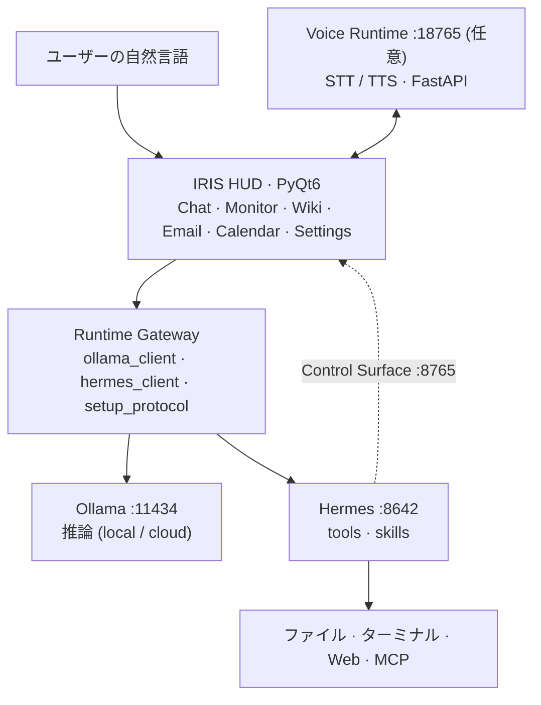

<div align="center">

[🇰🇷 한국어](README.md) · [🇺🇸 English](README.en.md) · **🇯🇵 日本語** · [🇨🇳 中文](README.zh.md)

</div>

# IRIS

**Open Source Desktop AI Agent Runtime**

IRIS は LLM・MCP・Voice Runtime・Local/Cloud Model をつなぎ、**自分の PC 上で動作する AI Agent Runtime** です。
有料サブスクリプションや手動連携なしに、インストーラー 1 つで [Ollama](https://ollama.com/)（モデル推論）と [Hermes Agent](https://hermes-agent.nousresearch.com/)（ツール・スキル）を準備し、対話型 HUD にまとめます。

単なるチャットボットではなく、次を目標としています。

- **Agent Runtime** — マルチステップのリクエスト処理
- **Tool Execution** — ファイル・ターミナル・Web の実行
- **MCP Integration** — 外部ツール連携
- **Voice Interaction** — STT/TTS を独立サービスとして分離
- **Runtime Gateway** — 実行境界の分離

[](LICENSE)
[](https://www.python.org/downloads/)
[](README.en.md#installation)
[](https://github.com/kwakminoo/Project-IRIS-Light/releases/latest)

> 表示名 **IRIS** · パッケージ名 Iris Light · アプリバージョン `0.1.0-light`

🌐 **紹介サイト — [cjh030906.github.io/iris-light-site](https://cjh030906.github.io/iris-light-site/)**

> このページは主要セクションの要約です。ハードウェア要件・インストールのトラブルシューティング・ライセンスの詳細は [English README](README.en.md) を参照してください。

---

## Demo

**インストールから実際の動作まで 3 分** — 動画は準備中です。撮影台本は [`docs/demo-video-script.md`](docs/demo-video-script.md) にあります。

以下 4 本の GIF は収録予定です。ファイルが用意できたら該当行のコメントを外します。
仕様は [`assets/demo/README.md`](assets/demo/README.md) にまとめています。

### 1. Agent Execution

```text
ユーザー入力 → IRIS HUD → Agent Runtime → Tool 実行
```

<!--  -->

### 2. Voice Interaction

```text
STT → UserTurnDispatcher → Agent Runtime → TTS
```

<!--  -->

### 3. Runtime Architecture

```text
GUI → Runtime Gateway → Hermes → Ollama
```

<!--  -->

### 4. Installation

```text
IRIS-Setup.exe → 仮想環境・パッケージ自動インストール → セットアップウィザード
```

<!--  -->

---

## Why IRIS?

既存の AI Assistant は特定サービスに依存するか、チャット UI で止まります。
逆にローカルモデルは「モデルを動かすだけ」で終わり、実際に PC 上でコーディング・文書・ファイル操作をさせるには手作業の連携が多く必要です。

IRIS はその差を次のように埋めます。

| 課題 | IRIS の解決方法 |
|------|------|
| 特定ベンダーへの依存 | Ollama・OpenAI 互換 provider を選んで接続 |
| Agent ロジックが UI に混在 | Runtime Gateway として実行境界を分離 |
| GPU がないと使えない | クラウドモデルを基本とし、ローカルモデルは任意 |
| 音声がアプリに固定 | Voice Runtime を独立した FastAPI サービス（`:18765`）に分離 |
| ツール拡張ができない | Hermes スキル・MCP で拡張 |
| インストールと連携が複雑 | インストーラーが Python・venv・パッケージ・ランタイムを自動処理 |

IRIS は Web 検索・シェル・ファイル IO を自前で再実装しません。
**セッション・権限・ストリーミング UI・セットアッププロトコル**を担当し、実行は Ollama/Hermes に委譲します。

---

## Features

| Feature | Description |
|---|---|
| **LLM Agent** | Hermes 経由のマルチステップ Tool 呼び出し（ファイル・ターミナル・Web） |
| **MCP** | `iris-control` stdio MCP · Hermes MCP 連携 |
| **Voice Runtime** | STT/TTS を FastAPI サービス（`:18765`）に分離（任意インストール） |
| **Runtime Gateway** | セッション・権限・ストリーミングを担う実行境界 |
| **Local Model** | Ollama ローカルモデル（`:11434`） |
| **Cloud Model** | GPU のない PC 向けの OpenAI 互換 provider |
| **セットアッププロトコル** | 初回起動時に Ollama・モデル・Hermes・provider・gateway・MCP を段階的に自動化 |
| **対話型 HUD** | モデル選択、履歴、思考／ツールログ、リアルタイムストリーミング |
| **Control Surface** | Hermes → UI の逆制御（`:8765`）· `iris-control` スキル |
| **ワークスペース** | システムモニター · メール（複数アカウント）· カレンダー · IDE Companion · Iris Wiki |
| **ローカル保存** | 設定・プロファイルを SQLite に保存（`~/.iris-light/`） |
| **任意拡張** | 画面学習（Aloha）· Android エミュレーター · mobile-mcp |

準備中: Instagram / Discord / Kakao / Telegram ワークスペース。

---

## Architecture



高解像度の図: [`docs/ia/iris-system-architecture.png`](docs/ia/iris-system-architecture.png)
設計ドキュメント: [domain · Runtime Gateway](docs/domain.md) · [情報構造・リクエスト経路](docs/ia/IA.md)

---

## Quick Start

**Python が初めての方でも、コマンド入力なしでインストールできます。**

<table>
<tr><td align="center"><b>1</b></td><td><a href="https://github.com/kwakminoo/Project-IRIS-Light/releases/latest/download/IRIS-Setup.exe"><b>IRIS-Setup.exe をダウンロード</b></a> — Windows 10/11 · 約 23MB</td></tr>
<tr><td align="center"><b>2</b></td><td><b>実行</b>します。署名証明書がないため Windows が一度ブロックします — <b>詳細情報 → 実行</b>。Python 確認・仮想環境・パッケージ・検証まで<b>すべて自動</b>で、数分かかります。</td></tr>
<tr><td align="center"><b>3</b></td><td>デスクトップの <b><code>IRIS</code></b> を実行します。セットアップウィザードが Ollama・Hermes のインストールを案内します。</td></tr>
</table>

ソースからインストールする場合は、リポジトリ内の **`setup.bat` をダブルクリック**します。

```powershell
.\setup.ps1              # 通常インストール
.\setup.ps1 -Run         # インストール後に起動
.\setup.ps1 -Voice       # 任意の Voice Runtime (.venv-voice) も導入
.\setup.ps1 -Recreate    # .venv を作り直す
```

Linux / macOS:

```bash
chmod +x setup.sh
./setup.sh               # --run / --recreate に対応
```

### 初回起動

1. **セットアップウィザード**が開きます。
2. Core: Ollama のインストール・起動 → 最小モデルの pull → Hermes 導入 → API/provider 接続 → gateway 起動。
3. Optional（STT 音声・Full TTS・Aloha 画面学習・エミュレーター・Node/mobile-mcp・クラウドログイン）は「今すぐ」か「後で」。
4. HUD のチャットに自然言語で依頼すると、Hermes/Ollama が応答と Tool 実行をストリーミングします。

> UI のみのデモ: `IRIS_SETUP_DEMO=1`（実インストールなし）· ドライラン: `IRIS_SETUP_DRY_RUN=1`

ハードウェア要件・インストールのトラブルシューティング表は [English README](README.en.md#installation) にあります。

---

## 実行

```powershell
.\run.bat        # 推奨: .venv の最新ソースで起動
python -m iris   # 同等
```

---

## Roadmap

実装済み:

- [x] LLM Agent Runtime（Hermes Tool 呼び出し・マルチステップ）
- [x] Voice Runtime（STT/TTS FastAPI サービス・任意インストール）
- [x] MCP Integration（`iris-control` stdio · Hermes MCP）
- [x] Local/Cloud Model Support（Ollama · OpenAI 互換 provider）
- [x] Installation System（`IRIS-Setup.exe` · `setup.ps1` / `setup.sh`）

計画:

- [ ] Plugin Marketplace
- [ ] Community Agent Skills
- [ ] Multi-Agent Collaboration
- [ ] Cloud Runtime
- [ ] Docker Deployment *(Optional — デスクトップアプリが主な実行形態のため必須ではありません)*

---

## Releases

最新: [**IRIS Light v2026.08.27**](https://github.com/kwakminoo/Project-IRIS-Light/releases/latest)（アプリバージョン `0.1.0-light`）

含まれるもの: Agent Runtime · Voice Runtime（任意）· MCP Integration · Installation System
リリース手順は [`docs/installer-release.md`](docs/installer-release.md) にあります。

---

## ドキュメント

| ドキュメント | 説明 |
|------|------|
| [docs/domain.md](docs/domain.md) | バウンデッドコンテキスト · Runtime Gateway 設計 |
| [docs/ia/IA.md](docs/ia/IA.md) | 情報構造 · リクエスト経路 · アーキテクチャ図 |
| [docs/api/](docs/api/) | API ドキュメント |
| [docs/voice.md](docs/voice.md) | 音声 STT/TTS · ボイスプロファイル |
| [docs/voice_architecture.md](docs/voice_architecture.md) | Voice Runtime の境界とフロー |
| [docs/installer-release.md](docs/installer-release.md) | インストーラービルド · リリース手順 |
| [integrations/hermes-skills/README.md](integrations/hermes-skills/README.md) | Iris Control Surface (Hermes ↔ UI) |
| [LICENSE.md](LICENSE.md) | ライセンス根拠 · サードパーティ一覧 |

---

## 貢献

Issue・PR を歓迎します。変更前に既存の `_check_*.py` スモークや該当モジュールの確認を実行してください。

```powershell
py -3 -m iris.ui._check_ide_companion_windows
```

---

## ライセンス

**GNU General Public License v3.0 以降（`GPL-3.0-or-later`）** — 全文は [`LICENSE`](LICENSE)。
`Copyright (C) 2026 IRIS Project Contributors`

UI 全体が **PyQt6**（商用ライセンスを購入しない限り GPL-3.0-only）の上に構築されているため、MIT・Apache-2.0 は選択できません。根拠とサードパーティのライセンス一覧は [`LICENSE.md`](LICENSE.md) にあります。

---

## 免責

IRIS は Hermes のツールを通じてローカルのファイルやターミナルに影響を与える可能性があります。
重要な操作の前に権限設定と確認ダイアログを確認してください。本番自動化・無人実行は利用者の責任で行ってください。
