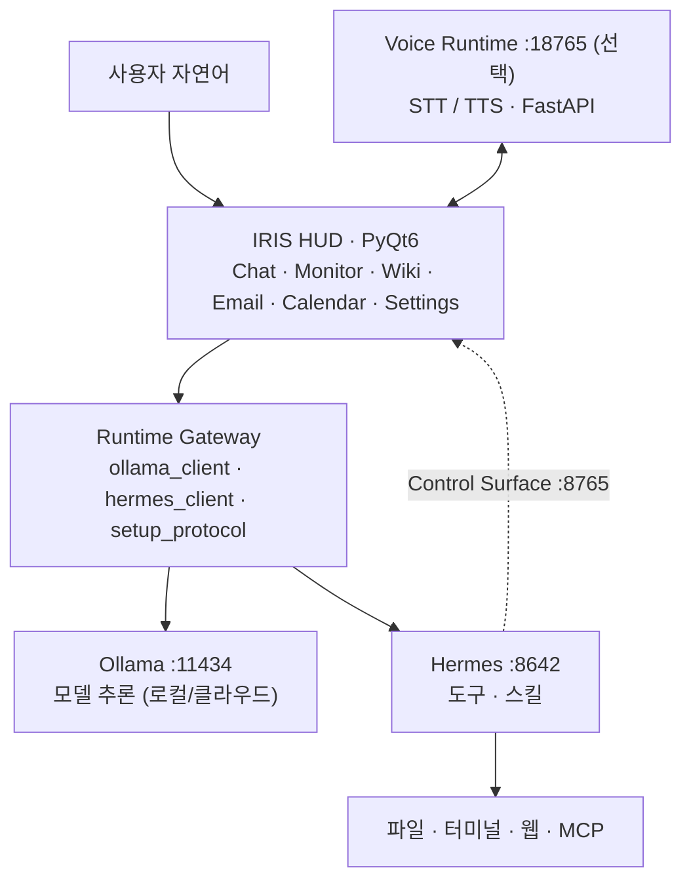

<div align="center">

**🇰🇷 한국어** · [🇺🇸 English](README.en.md) · [🇯🇵 日本語](README.ja.md) · [🇨🇳 中文](README.zh.md)

</div>

# IRIS

**Open Source Desktop AI Agent Runtime**

IRIS는 LLM · MCP · Voice Runtime · Local/Cloud Model을 연결해 **내 PC에서 실행되는 AI Agent Runtime**입니다.
유료 구독이나 복잡한 수동 연동 없이, 설치 프로그램 하나로 [Ollama](https://ollama.com/)(모델 추론)와 [Hermes Agent](https://hermes-agent.nousresearch.com/)(도구·스킬)를 준비하고 대화형 HUD로 묶습니다.

단순 챗봇이 아니라 다음을 목표로 합니다.

- **Agent Runtime** — 멀티스텝 요청 처리
- **Tool Execution** — 파일 · 터미널 · 웹 실행
- **MCP Integration** — 외부 도구 연동
- **Voice Interaction** — STT/TTS 독립 서비스
- **Runtime Gateway** — 실행 경계 분리

[](LICENSE)
[](https://www.python.org/downloads/)
[](#설치)
[](https://github.com/kwakminoo/Project-IRIS-Light/releases/latest)

> 표시 이름 **IRIS** · 코드/패키지명 Iris Light · 앱 버전 `0.1.0-light`

🌐 **소개 사이트 — [iris-light-site.vercel.app](https://iris-light-site.vercel.app/)** ([저장소](https://github.com/cjh030906/iris-light-site))

---

## Demo

**설치부터 실제 동작까지 3분** — 영상 준비 중입니다. 촬영 대본과 업로드 절차는 [`docs/demo-video-script.md`](docs/demo-video-script.md)에 있습니다.

검증관·기여자용 **클릭 단위 재현**은 데모 영상과 별도입니다 → [`docs/검증/기능테스트-시나리오서.md`](docs/검증/기능테스트-시나리오서.md)

<!-- DEMO_VIDEO:START -->
<!--
  ⚠ 영상 업로드 후 아래 줄의 주석을 풀고 VIDEO_ID 를 실제 값으로 바꾸세요.
     VIDEO_ID = https://youtu.be/여기11자리
[](https://youtu.be/VIDEO_ID)
-->
<!-- DEMO_VIDEO:END -->

아래 4개 GIF는 녹화 예정입니다. 파일이 준비되면 각 항목의 주석만 풀면 됩니다.
스펙(길이·해상도·촬영 순서)은 [`assets/demo/README.md`](assets/demo/README.md)에 정리돼 있습니다.

### 1. Agent Execution

```text
사용자 명령 입력 → IRIS HUD → Agent Runtime → Tool 실행
```

<!--  -->

### 2. Voice Interaction

```text
STT → UserTurnDispatcher → Agent Runtime → TTS
```

<!--  -->

### 3. Runtime Architecture

```text
GUI → Runtime Gateway → Hermes → Ollama
```

<!--  -->

### 4. Installation

```text
IRIS-Setup.exe → 가상환경·패키지 자동 설치 → 시작 위저드
```

<!--  -->

---

## Why IRIS?

기존 AI Assistant는 특정 서비스에 종속되거나, 대화 인터페이스 하나에 머무릅니다.
반대로 로컬 모델은 "모델만 돌리기"에서 멈추고, 실제 PC에서 코딩·문서·파일 작업을 시키는 단계까지 가려면 직접 연동해야 할 것이 많습니다.

IRIS는 그 간격을 다음 방식으로 좁힙니다.

| 문제 | IRIS의 해결 방식 |
|------|------|
| 특정 벤더에 종속 | Ollama · OpenAI 호환 provider를 골라 연결 |
| Agent 로직이 UI에 섞임 | Runtime Gateway로 실행 경계를 분리 |
| GPU 없으면 못 씀 | 클라우드 모델을 기본으로, 로컬 모델은 선택 |
| 음성이 앱에 묶임 | Voice Runtime을 별도 FastAPI 서비스(`:18765`)로 분리 |
| 도구 확장이 막힘 | Hermes 스킬 · MCP로 확장 |
| 설치·연동이 복잡 | 설치 프로그램이 Python·venv·패키지·런타임까지 자동 처리 |

IRIS는 웹검색·셸·파일 IO를 자체 재구현하지 않습니다.
**세션·권한·스트리밍 UI·시작 프로토콜**을 담당하고, 실행은 Ollama/Hermes에 위임합니다.

<details>
<summary><b>기대 효과 (프로젝트 배경)</b></summary>

- **접근성**: 구독료·복잡한 에이전트 셋업이 부담인 학생·취준생·초보 개발자의 진입 장벽을 낮춥니다.
- **실습형 AI**: 답만 받는 소비를 넘어, 코딩·문서·파일 작업을 로컬 PC에서 직접 수행하며 활용 역량을 키웁니다.
- **격차 완화**: PC 사양에 맞는 모델을 연결해, 경제적·디지털 격차로 인한 AI 경험 불평등을 줄이는 데 기여합니다.
- **프라이버시·자립**: 로컬 실행으로 민감 정보 외부 전송을 줄이고, 특정 벤더에만 의존하지 않는 사용이 가능합니다.

</details>

---

## Features

| Feature | Description |
|---|---|
| **LLM Agent** | Hermes를 통한 멀티스텝 도구 호출 (파일·터미널·웹) |
| **MCP** | `iris-control` stdio MCP · Hermes MCP 연동 |
| **Voice Runtime** | STT/TTS를 별도 FastAPI 서비스(`:18765`)로 분리 (선택 설치) |
| **Runtime Gateway** | 세션·권한·스트리밍을 담당하는 실행 경계 |
| **Local Model** | Ollama 로컬 모델 (`:11434`) |
| **Cloud Model** | GPU 없는 PC를 위한 OpenAI 호환 provider |
| **시작 프로토콜** | 첫 실행 시 Ollama·모델·Hermes·provider·gateway·MCP를 단계적으로 자동화 |
| **대화형 HUD** | 모델 선택, 대화 이력, 사고/도구 로그, 실시간 스트리밍 |
| **Control Surface** | Hermes → UI 역제어 (`:8765`) · `iris-control` 스킬 |
| **워크스페이스** | 시스템 모니터 · 이메일(다중 계정) · 캘린더 · IDE Companion · Iris Wiki |
| **로컬 저장** | 설정·프로필 등 SQLite (`~/.iris-light/`) |
| **선택 확장** | 화면 학습(Aloha) · Android 에뮬레이터 · mobile-mcp |

준비 중: Instagram / Discord / Kakao / Telegram 워크스페이스.

---

## Architecture



전체 해상도 다이어그램: [`docs/ia/iris-system-architecture.png`](docs/ia/iris-system-architecture.png)
설계 문서: [도메인·Runtime Gateway](docs/domain.md) · [정보 구조·요청 경로](docs/ia/IA.md)

---

## Quick Start

**파이썬을 처음 써 보는 분도 명령어 입력 없이 설치할 수 있습니다.**

<table>
<tr><td align="center"><b>1</b></td><td><a href="https://github.com/kwakminoo/Project-IRIS-Light/releases/latest/download/IRIS-Setup.exe"><b>IRIS-Setup.exe 내려받기</b></a> — Windows 10/11 · 약 23MB</td></tr>
<tr><td align="center"><b>2</b></td><td><b>실행</b>합니다. 서명 인증서가 없어 Windows가 한 번 막습니다 — <b>추가 정보 → 실행</b>. 파이썬 확인 · 가상환경 · 패키지 설치 · 검증까지 <b>전부 자동</b>이라 몇 분 걸립니다.</td></tr>
<tr><td align="center"><b>3</b></td><td>바탕화면의 <b><code>IRIS</code></b> 를 실행합니다. 시작 위저드가 Ollama · Hermes 설치를 이어서 안내합니다.</td></tr>
</table>

### 첫 실행

1. 앱이 **시작 위저드**를 띄웁니다.
2. Core 단계: Ollama 공식 설치·기동 → 최소 모델 pull → Hermes 설치 → API/provider 연결 → gateway 기동.
3. Optional(STT 음성·Full TTS·업무학습 Aloha·에뮬레이터·Node/mobile-mcp·클라우드 로그인 등)은 「설치」또는 「나중에」.
4. HUD 채팅에서 자연어 요청을 보내면, Hermes/Ollama가 응답·도구 실행을 스트리밍합니다.

> 데모만 보려면: `IRIS_SETUP_DEMO=1` (실제 설치 없음) · UI 미리보기: `IRIS_SETUP_DRY_RUN=1`

---

## 설치

### 방법 A — 설치 프로그램 (권장)

[**IRIS-Setup.exe**](https://github.com/kwakminoo/Project-IRIS-Light/releases/latest/download/IRIS-Setup.exe)
를 받아 실행합니다. `%LOCALAPPDATA%\Programs\IRIS` 에 설치한 뒤, 아래 방법 B와 똑같은
`setup.ps1` 을 돌려 가상환경과 패키지를 준비합니다.

- 서명 인증서가 없어 Windows SmartScreen이 한 번 경고합니다 — **추가 정보 → 실행**
- 패키지를 받는 데 몇 분 걸립니다. 진행 기록은 설치 폴더의 `setup-log.txt` · `setup-log-pip.txt` 에 남습니다
- 설치가 중간에 끊겼다면 설치 폴더의 `setup.bat` 을 다시 실행하면 이어서 복구합니다

### 방법 B — 소스에서 자동 설치

저장소 폴더에서 **`setup.bat` 을 더블클릭**하면 끝입니다. 터미널을 열 필요도, 명령어를 외울 필요도 없습니다.

```powershell
.\setup.ps1              # 기본 설치
.\setup.ps1 -Run         # 설치 후 바로 실행
.\setup.ps1 -Voice       # 선택 음성 런타임(.venv-voice)까지 설치
.\setup.ps1 -Recreate    # .venv 를 지우고 새로 만들기 (설치가 꼬였을 때)
```

Linux / macOS:

```bash
chmod +x setup.sh
./setup.sh               # --run / --recreate 옵션 지원
```

> 실행 정책(`ExecutionPolicy`) 때문에 `.ps1` 이 막히는 환경에서도 `setup.bat` 은
> 정상 동작합니다. 내부에서 `-ExecutionPolicy Bypass` 로 우회합니다.

### 방법 C — 수동 설치

```powershell
git clone https://github.com/kwakminoo/Project-IRIS-Light.git
cd Project-IRIS-Light

python -m venv .venv
.\.venv\Scripts\Activate.ps1
pip install -r requirements.txt
copy .env.example .env
```

<details>
<summary><b>setup.ps1 이 처리하는 단계</b></summary>

| 단계 | 하는 일 | 실패하면 |
|:---:|------|------|
| 1 | Python 3.11+ 탐색 (`py -3.13/-3.12/-3.11` → `python`) | 설치 링크와 `winget` 명령을 화면에 안내 |
| 2 | 가상환경 `.venv` 생성 (이미 있으면 재사용) | `venv` 모듈 설치 방법 안내 |
| 3 | `pip` 업그레이드 | 경고만 남기고 기존 pip으로 계속 |
| 4 | `requirements.txt` 전체 설치 | 프록시·사내망용 대체 명령 안내 |
| 5 | `.env.example` → `.env` 복사 | 기존 `.env` 는 절대 덮어쓰지 않음 |
| 6 | PyQt6 등 핵심 패키지 **import 검증** | VC++ 재배포 패키지 설치 명령 안내 |

</details>

<details>
<summary><b>설치가 잘 안 될 때 (증상별 해결)</b></summary>

| 증상 | 원인 · 해결 |
|------|------|
| `Python 3.11 이상을 찾지 못했습니다` | Python 미설치 또는 PATH 누락. 설치 시 **[Add python.exe to PATH]** 체크. `winget install -e --id Python.Python.3.12` |
| `이 시스템에서 스크립트를 실행할 수 없으므로` | `.ps1` 직접 실행이 막힌 경우. **`setup.bat` 을 쓰세요** |
| 가상환경 생성 실패 | Microsoft Store 버전 Python은 문제가 잦습니다. [python.org](https://www.python.org/downloads/) 배포판 권장. Debian 계열은 `sudo apt install python3-venv` |
| 패키지 설치 중 네트워크 오류 | 사내망/프록시. `pip install -r requirements.txt --trusted-host pypi.org --trusted-host files.pythonhosted.org` |
| PyQt6 import 실패 | Windows: `winget install -e --id Microsoft.VCRedist.2015+.x64` · Linux: `sudo apt install libgl1 libegl1 libxkbcommon-x11-0 libxcb-cursor0` |
| 설치는 끝났는데 앱이 안 뜸 | 의존성 설치가 중간에 끊긴 경우입니다. 실행하면 이유를 창으로 알려 주고 `%LOCALAPPDATA%\iris-light\launcher.log` 에 남깁니다. 설치 폴더의 `setup.bat` 을 다시 실행하세요 |
| 그래도 안 될 때 | `.\setup.ps1 -Recreate` 로 가상환경을 통째로 다시 만들기 |

</details>

<details>
<summary><b>필요 사양</b></summary>

### 소프트웨어

- **Windows 10/11** 권장 (시작 프로토콜·winget/Hermes 설치 스크립트 기준)
- Python **3.11+** 권장
- **안정적인 인터넷** 필수 (클라우드 모델·도구 호출)

### 하드웨어 (클라우드 모델 위주)

IRIS는 기본적으로 **클라우드 모델**로 추론하고, 로컬에는 UI·Hermes 게이트웨이·도구 실행만 둡니다.
로컬 LLM용 GPU/VRAM은 필요하지 않습니다. 아래 저장 공간은 **IRIS 관련 설치분**(앱·venv·Ollama/Hermes 런타임, 대용량 로컬 모델·에뮬레이터 제외) 기준입니다.

| 구분 | 최소 | 권장 |
|------|------|------|
| **OS** | Windows 10/11 64bit | Windows 11 |
| **CPU** | 듀얼~쿼드코어 (사무용 i3 / Ryzen 3 이상) | i5 / Ryzen 5 이상 |
| **RAM** | **8GB** (가능하나 도구·브라우저 병행 시 빡쁨) | **16GB** |
| **GPU** | **불필요** | 불필요 |
| **저장 (IRIS만)** | 여유 **약 20GB** | 여유 **약 30GB** |
| **네트워크** | 인터넷 연결 | 지연 낮은 안정 회선 |

- OS·다른 프로그램용 SSD 용량은 별도입니다. PC 구매 시에는 보통 256GB 이상을 권합니다.
- Android 에뮬레이터·화면 학습·로컬 대용량 모델을 쓰면 저장·RAM이 추가로 필요합니다.

</details>

---

## 실행

```powershell
# 권장: 소스(.venv)로 최신 코드 실행 — 로컬 수정이 즉시 반영됩니다
.\run.bat

# 또는
python -m iris
```

Linux/macOS:

```bash
chmod +x run.sh
./run.sh
# 또는: python3 -m iris
```

<details>
<summary><b>EXE·바로가기 동작 방식</b></summary>

`run.bat`은 **`.venv`의 `python -m iris`를 기본**으로 씁니다.
`dist\IRIS.exe`는 예전 스냅샷일 수 있어, 더 이상 기본 경로가 아닙니다.

- 패키지 EXE만 쓰려면: `set IRIS_USE_EXE=1` 후 `.\run.bat`
- EXE를 더블클릭해도 저장소에 `.venv`가 있으면 **최신 소스로 자동 전환**합니다 (한 번 `scripts\build_iris_exe.ps1`로 새 EXE를 빌드한 뒤부터).
- EXE 본체로만 돌리려면: `set IRIS_FORCE_FROZEN=1`

바로가기(바탕화면/시작메뉴)도 소스 우선입니다.

```powershell
.\scripts\install_iris_shortcuts.ps1
```

</details>

---

## Roadmap

구현 완료:

- [x] LLM Agent Runtime (Hermes 도구 호출 · 멀티스텝)
- [x] Voice Runtime (STT/TTS FastAPI 서비스 · 선택 설치)
- [x] MCP Integration (`iris-control` stdio · Hermes MCP)
- [x] Local/Cloud Model Support (Ollama · OpenAI 호환 provider)
- [x] Installation System (`IRIS-Setup.exe` · `setup.ps1` / `setup.sh`)

계획:

- [ ] Plugin Marketplace
- [ ] Community Agent Skills
- [ ] Multi-Agent Collaboration
- [ ] Cloud Runtime
- [ ] Docker Deployment *(Optional — 데스크톱 앱이 주 실행 형태이므로 필수 아님)*

---

## Releases

최신: [**IRIS Light v2026.08.27**](https://github.com/kwakminoo/Project-IRIS-Light/releases/latest) (앱 버전 `0.1.0-light`)

포함 범위:

- Agent Runtime (Hermes 연동 · 도구 실행)
- Voice Runtime (STT/TTS · 선택 설치)
- MCP Integration
- Installation System (`IRIS-Setup.exe` · 자동 setup 스크립트)

배포 절차는 [`docs/installer-release.md`](docs/installer-release.md)에 있습니다.

---

## 문서

| 문서 | 설명 |
|------|------|
| [docs/domain.md](docs/domain.md) | 바운디드 컨텍스트 · Runtime Gateway 설계 |
| [docs/ia/IA.md](docs/ia/IA.md) | 정보 구조 · 요청 경로 · 아키텍처 다이어그램 |
| [docs/api/](docs/api/) | API 관련 문서 |
| [docs/guides/extending-iris.md](docs/guides/extending-iris.md) | 코어 불변 · 스킬/MCP 확장 |
| [docs/guides/ui-toolkit-migration.md](docs/guides/ui-toolkit-migration.md) | PyQt6→PySide6 UI 전환 가이드 (문서만) |
| [docs/guides/agent-readable-docs.md](docs/guides/agent-readable-docs.md) | AI·인간 공용 모듈 헤더 계약 |
| [docs/검증/기능테스트-시나리오서.md](docs/검증/기능테스트-시나리오서.md) | 검증관용 클릭 단위 시나리오 |
| [docs/검증/core-smoke.md](docs/검증/core-smoke.md) | 코어 스모크 1커맨드 |
| [docs/검증/license-scan-report.md](docs/검증/license-scan-report.md) | 라이선스 스캔·충돌 0 리포트 |
| [docs/voice.md](docs/voice.md) | 음성 STT/TTS · 보이스 프로필 |
| [docs/voice_architecture.md](docs/voice_architecture.md) | 음성 런타임 경계 · 흐름 |
| [docs/installer-release.md](docs/installer-release.md) | 설치 프로그램 빌드 · 릴리스 절차 |
| [docs/demo-video-script.md](docs/demo-video-script.md) | 데모 영상 촬영 대본 · 업로드 절차 |
| [integrations/hermes-skills/README.md](integrations/hermes-skills/README.md) | Iris Control Surface (Hermes ↔ UI) |
| [LICENSE.md](LICENSE.md) | 라이선스 근거 · 서드파티 인벤토리 |
| [THIRD_PARTY_NOTICES.md](THIRD_PARTY_NOTICES.md) | 제3자 고지 |
| [CONTRIBUTING.md](CONTRIBUTING.md) | 기여 가이드 |

<details>
<summary><b>프로젝트 구조 · 기술 스택</b></summary>

```text
iris/                 # 앱 본체
  ui/                 # PyQt6 HUD (채팅, 모니터, 위키, 메일, 캘린더, IDE, 설정…)
  system/             # setup_protocol, ollama_server, hermes_gateway, control_surface
  infrastructure/     # Ollama/Hermes/email/calendar HTTP 클라이언트
  runtime/            # UserTurnDispatcher · voice intents
  knowledge/          # Iris Wiki · Obsidian vault
  storage/            # SQLite 설정·프로필·메일 계정 등
  monitoring/         # 모니터·알림·콜
  learning/           # (선택) 화면 학습 Aloha
  audio/              # (선택) 음성 클라이언트 · VAD/AEC
  mcp/                # iris-control stdio
services/voice_runtime/  # (선택) FastAPI STT/TTS :18765
integrations/         # Hermes 스킬·플러그인, Aloha 등
docs/                 # 도메인·IA·API·음성 설계
obsidian-vault/       # 프로젝트 지식 베이스 (Wiki docs 소스)
scripts/              # 빌드·보이스 프로필·설치 보조 스크립트
setup.bat             # ★ 자동 설치 — 더블클릭 진입점 (Windows)
setup.ps1             # 자동 설치 본체 (Windows)
setup.sh              # 자동 설치 (Linux/macOS)
run.bat / run.sh      # 실행
.env.example          # 환경 설정 템플릿 (setup 이 .env 로 복사)
requirements.txt
LICENSE               # GPL v3 전문
LICENSE.md            # 라이선스 근거·서드파티 인벤토리
```

| 구분 | 기술 |
|------|------|
| UI | Python, PyQt6, PyQt6-WebEngine |
| 모델 | Ollama (OpenAI 호환 `/v1`) |
| 에이전트 | Hermes Agent (gateway API, skills, MCP) |
| 음성 | FastAPI (`services/voice_runtime`) |
| 저장 | SQLite (`~/.iris-light/`) |
| 지식 | Obsidian 호환 Markdown vault |
| 기타 | psutil, mss, openai/anthropic SDK 등 (`requirements.txt`) |

</details>

---

## 기여

이슈·PR 환영합니다. 절차·라이선스·확장점은 [`CONTRIBUTING.md`](CONTRIBUTING.md)를 먼저 보세요.

```powershell
# 핵심 스모크 묶음
powershell -ExecutionPolicy Bypass -File scripts\run_core_smoke.ps1

# 예: IDE companion orphan 창 회귀 방지
py -3 -m iris.ui._check_ide_companion_windows
```

---

## 라이선스

[](LICENSE)

**GNU General Public License v3.0 이상 (`GPL-3.0-or-later`)** — 전문은 루트 [`LICENSE`](LICENSE).

`Copyright (C) 2026 IRIS Project Contributors`

<details>
<summary><b>왜 GPLv3인가</b></summary>

IRIS의 UI 전체는 **PyQt6** 위에 올라가 있고, PyQt6는 상업 라이선스를 구매하지 않는 한
**GPL-3.0-only** 입니다 (`License-Expression: GPL-3.0-only`). 저장소는 PyQt6를 번들한
`dist/IRIS.exe` 를 직접 배포하므로 이 조건이 이론이 아니라 실제로 적용됩니다.
따라서 **MIT·Apache-2.0은 선택할 수 없으며**, GPLv3 제약을 만족하는 것 중 가장
개방적인 선택이 `GPL-3.0-or-later` 입니다.

나머지 의존성은 모두 GPLv3와 호환됩니다 — mutagen(GPL-2.0-**or-later**),
pynput·soxr(LGPL), ShowUI-Aloha(Apache-2.0, 벤더링), 그 외 MIT/BSD/Apache/MPL-2.0.

전체 근거와 서드파티 라이선스 인벤토리, 모델 가중치·음성 데이터 취급, 더 개방적인
라이선스로 가는 경로는 **[`LICENSE.md`](LICENSE.md)** 에 정리돼 있습니다.

> 기여자 안내: 이 저장소에 보낸 PR은 GPL-3.0-or-later로 제공하는 데 동의하는 것으로
> 간주합니다. 새 의존성 추가 시 GPL-3.0 비호환 라이선스(독점, GPL-2.0-**only**,
> CC BY-**NC**, 비상업용 커스텀)는 받을 수 없습니다.

</details>

---

## 면책

IRIS는 Hermes 도구를 통해 로컬 파일·터미널에 영향을 줄 수 있습니다.
중요한 작업 전에는 권한 설정과 확인 다이얼로그를 확인하세요. 프로덕션 자동화·무인 실행은 사용자 책임 하에 진행하세요.
