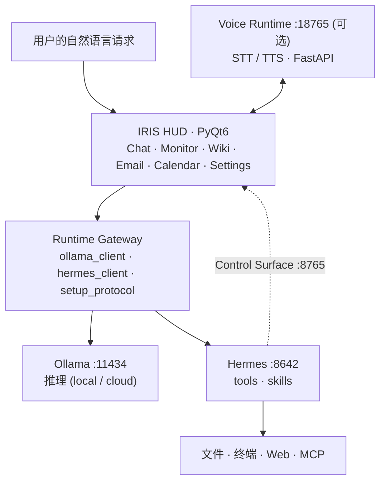

<div align="center">

[🇰🇷 한국어](README.md) · [🇺🇸 English](README.en.md) · [🇯🇵 日本語](README.ja.md) · **🇨🇳 中文**

</div>

# IRIS

**Open Source Desktop AI Agent Runtime**

IRIS 将 LLM、MCP、Voice Runtime 与 Local/Cloud Model 连接起来，是一个**运行在你自己 PC 上的 AI Agent Runtime**。
无需付费订阅或手动接线，一个安装程序即可准备好 [Ollama](https://ollama.com/)（模型推理）与 [Hermes Agent](https://hermes-agent.nousresearch.com/)（工具与技能），并整合进对话式 HUD。

它的目标不止于聊天机器人：

- **Agent Runtime** — 多步骤请求处理
- **Tool Execution** — 文件、终端、Web 执行
- **MCP Integration** — 外部工具接入
- **Voice Interaction** — STT/TTS 作为独立服务
- **Runtime Gateway** — 分离的执行边界

[](LICENSE)
[](https://www.python.org/downloads/)
[](README.en.md#installation)
[](https://github.com/kwakminoo/Project-IRIS-Light/releases/latest)

> 显示名称 **IRIS** · 包名 Iris Light · 应用版本 `0.1.0-light`

🌐 **项目介绍站 — [iris-light-site.vercel.app](https://iris-light-site.vercel.app/)**

> 本页为主要章节的摘要。硬件要求、安装故障排查与许可证细节请参阅 [English README](README.en.md)。

---

## Demo

**从安装到实际运行只需 3 分钟** — 视频尚未发布。录制脚本见 [`docs/demo-video-script.md`](docs/demo-video-script.md)。

下面 4 个 GIF 尚待录制。文件就位后，取消对应行的注释即可。
规格说明见 [`assets/demo/README.md`](assets/demo/README.md)。

### 1. Agent Execution

```text
用户输入 → IRIS HUD → Agent Runtime → Tool 执行
```

<!--  -->

### 2. Voice Interaction

```text
STT → UserTurnDispatcher → Agent Runtime → TTS
```

<!--  -->

### 3. Runtime Architecture

```text
GUI → Runtime Gateway → Hermes → Ollama
```

<!--  -->

### 4. Installation

```text
IRIS-Setup.exe → 自动创建虚拟环境并安装依赖 → 启动向导
```

<!--  -->

---

## Why IRIS?

现有的 AI Assistant 往往绑定在特定服务上，或者止步于一个聊天界面。
本地模型则相反：只做到"把模型跑起来"，要让它真正在你的机器上写代码、处理文档和文件，还需要大量手动集成。

IRIS 用以下方式缩小这个差距：

| 问题 | IRIS 的解决方式 |
|------|------|
| 绑定单一厂商 | 可选择连接 Ollama 或任意 OpenAI 兼容 provider |
| Agent 逻辑与 UI 混杂 | 以 Runtime Gateway 分离执行边界 |
| 没有 GPU 就用不了 | 默认使用云端模型，本地模型为可选 |
| 语音被固化在应用里 | Voice Runtime 作为独立 FastAPI 服务运行（`:18765`） |
| 工具难以扩展 | 通过 Hermes skills 与 MCP 扩展 |
| 安装与接线复杂 | 安装程序自动处理 Python、venv、依赖与运行时 |

IRIS 不会重新实现网页搜索、Shell 或文件 IO。
它负责**会话、权限、流式 UI 与安装协议**，执行则委托给 Ollama/Hermes。

---

## Features

| Feature | Description |
|---|---|
| **LLM Agent** | 通过 Hermes 进行多步骤工具调用（文件、终端、Web） |
| **MCP** | `iris-control` stdio MCP · Hermes MCP 集成 |
| **Voice Runtime** | 将 STT/TTS 拆分为 FastAPI 服务（`:18765`，可选安装） |
| **Runtime Gateway** | 负责会话、权限与流式输出的执行边界 |
| **Local Model** | Ollama 本地模型（`:11434`） |
| **Cloud Model** | 面向无 GPU 机器的 OpenAI 兼容 provider |
| **安装协议** | 首次运行时分步自动化 Ollama、模型、Hermes、provider、gateway、MCP |
| **对话式 HUD** | 模型选择、历史记录、思考/工具日志、实时流式输出 |
| **Control Surface** | Hermes → UI 反向控制（`:8765`）· `iris-control` 技能 |
| **工作区** | 系统监控 · 邮件（多账户）· 日历 · IDE Companion · Iris Wiki |
| **本地存储** | 使用 SQLite 保存设置与配置（`~/.iris-light/`） |
| **可选扩展** | 屏幕学习（Aloha）· Android 模拟器 · mobile-mcp |

开发中：Instagram / Discord / Kakao / Telegram 工作区。

---

## Architecture



高分辨率架构图：[`docs/ia/iris-system-architecture.png`](docs/ia/iris-system-architecture.png)
设计文档：[domain · Runtime Gateway](docs/domain.md) · [信息架构与请求路径](docs/ia/IA.md)

---

## Quick Start

**即使没用过 Python，也无需输入任何命令即可安装。**

<table>
<tr><td align="center"><b>1</b></td><td><a href="https://github.com/kwakminoo/Project-IRIS-Light/releases/latest/download/IRIS-Setup.exe"><b>下载 IRIS-Setup.exe</b></a> — Windows 10/11 · 约 23MB</td></tr>
<tr><td align="center"><b>2</b></td><td><b>运行</b>它。由于没有代码签名证书，Windows 会拦截一次 — <b>更多信息 → 仍要运行</b>。Python 检测、虚拟环境、依赖安装与校验<b>全部自动</b>，需要几分钟。</td></tr>
<tr><td align="center"><b>3</b></td><td>运行桌面上的 <b><code>IRIS</code></b>。启动向导会继续引导安装 Ollama 与 Hermes。</td></tr>
</table>

从源码安装时，在仓库目录中**双击 `setup.bat`**即可。

```powershell
.\setup.ps1              # 默认安装
.\setup.ps1 -Run         # 安装后立即运行
.\setup.ps1 -Voice       # 同时安装可选的 Voice Runtime (.venv-voice)
.\setup.ps1 -Recreate    # 删除并重建 .venv
```

Linux / macOS:

```bash
chmod +x setup.sh
./setup.sh               # 支持 --run / --recreate
```

### 首次运行

1. 应用会打开**启动向导**。
2. Core 步骤：安装并启动 Ollama → 拉取最小模型 → 安装 Hermes → 连接 API/provider → 启动 gateway。
3. Optional（STT 语音、Full TTS、Aloha 屏幕学习、模拟器、Node/mobile-mcp、云端登录）可现在安装或稍后。
4. 在 HUD 聊天中用自然语言下达请求，Hermes/Ollama 会流式返回回答与工具执行过程。

> 仅预览 UI：`IRIS_SETUP_DEMO=1`（不做真实安装）· 空跑：`IRIS_SETUP_DRY_RUN=1`

硬件要求与安装故障排查表见 [English README](README.en.md#installation)。

---

## 运行

```powershell
.\run.bat        # 推荐：以 .venv 运行最新源码
python -m iris   # 等效
```

---

## Roadmap

已实现：

- [x] LLM Agent Runtime（Hermes 工具调用 · 多步骤）
- [x] Voice Runtime（STT/TTS FastAPI 服务 · 可选安装）
- [x] MCP Integration（`iris-control` stdio · Hermes MCP）
- [x] Local/Cloud Model Support（Ollama · OpenAI 兼容 provider）
- [x] Installation System（`IRIS-Setup.exe` · `setup.ps1` / `setup.sh`）

计划中：

- [ ] Plugin Marketplace
- [ ] Community Agent Skills
- [ ] Multi-Agent Collaboration
- [ ] Cloud Runtime
- [ ] Docker Deployment *(Optional — 桌面应用是主要运行形态，因此并非必需)*

---

## Releases

最新版本：[**IRIS Light v2026.08.27**](https://github.com/kwakminoo/Project-IRIS-Light/releases/latest)（应用版本 `0.1.0-light`）

包含内容：Agent Runtime · Voice Runtime（可选）· MCP Integration · Installation System
发布流程见 [`docs/installer-release.md`](docs/installer-release.md)。

---

## 文档

| 文档 | 说明 |
|------|------|
| [docs/domain.md](docs/domain.md) | 限界上下文 · Runtime Gateway 设计 |
| [docs/ia/IA.md](docs/ia/IA.md) | 信息架构 · 请求路径 · 架构图 |
| [docs/api/](docs/api/) | API 文档 |
| [docs/voice.md](docs/voice.md) | 语音 STT/TTS · 语音配置 |
| [docs/voice_architecture.md](docs/voice_architecture.md) | Voice Runtime 边界与流程 |
| [docs/installer-release.md](docs/installer-release.md) | 安装程序构建 · 发布流程 |
| [integrations/hermes-skills/README.md](integrations/hermes-skills/README.md) | Iris Control Surface (Hermes ↔ UI) |
| [LICENSE.md](LICENSE.md) | 许可证依据 · 第三方清单 |

---

## 贡献

欢迎提交 Issue 与 PR。修改前请尽量运行已有的 `_check_*.py` 冒烟检查或相关模块的单元检查。

```powershell
py -3 -m iris.ui._check_ide_companion_windows
```

---

## 许可证

**GNU General Public License v3.0 或更高版本（`GPL-3.0-or-later`）** — 全文见 [`LICENSE`](LICENSE)。
`Copyright (C) 2026 IRIS Project Contributors`

整个 UI 构建在 **PyQt6** 之上（除购买商业许可外为 GPL-3.0-only），因此无法选择 MIT 或 Apache-2.0。完整依据与第三方许可证清单见 [`LICENSE.md`](LICENSE.md)。

---

## 免责声明

IRIS 可通过 Hermes 工具影响本地文件与终端。
执行重要操作前请确认权限设置与确认对话框。生产环境自动化与无人值守运行由使用者自行承担风险。
