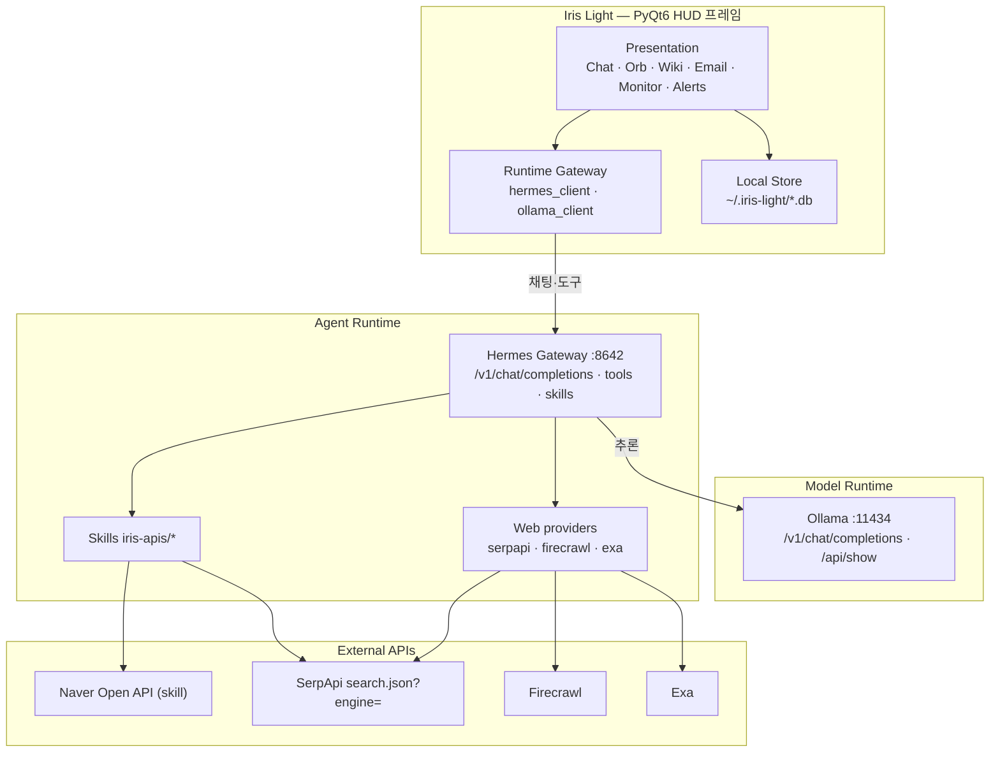

# Iris Light — Information Architecture (IA)

> Generated-at: 2026-07-22  
> 관련 이미지: [iris-light-ia.png](./iris-light-ia.png) · [../assets/iris-light-ia.png](../assets/iris-light-ia.png)

## 1. 한 줄 정의

**Iris Light는 Ollama(모델)와 Hermes Agent(도구·스킬)를 감싸는 데스크톱 HUD 프레임(프론트엔드)** 이다.  
웹검색·터미널·스킬 실행은 Iris가 직접 구현하지 않고 Hermes 게이트웨이에 위임한다.

| 질문 | 답 |
|------|-----|
| Iris가 “뇌”인가? | 아니오 — **어댑터/프레임** |
| 모델은? | **Ollama** (`:11434`, 로컬/클라우드) |
| 도구·스킬은? | **Hermes** (`:8642` API Server) |
| 외부 SERP/크롤? | Hermes 플러그인·스킬 → SerpApi / Exa / Firecrawl 등 |

## 2. IA 다이어그램

## 3. 레이어 설명

| 레이어 | 책임 | 소유 |
|--------|------|------|
| **Presentation** | HUD, 채팅 스트림 표시, 모델 콤보, Wiki/메일 UI | Iris |
| **Runtime Gateway** | Hermes/Ollama HTTP 어댑터, 모델 동기화 | Iris |
| **Model Runtime** | LLM 추론 | Ollama (외부) |
| **Agent Runtime** | tool-calling, 스킬, 웹 백엔드 | Hermes (외부) |
| **External APIs** | SERP/크롤/검색 키 | Hermes `.env` |

## 4. 사용자 요청 경로 (스타트 → 엔드)

1. 사용자 → Iris Chat Send  
2. Iris → `POST http://127.0.0.1:8642/v1/chat/completions` (Hermes)  
3. Hermes → Ollama로 추론 (tools 지원 모델)  
4. 필요 시 Hermes → `web_search` (SerpApi `engine=…`) / 스킬 / terminal  
5. 스트림 → Iris Live Activity + 채팅 UI  

## 5. 설정 파일 IA

| 파일 | 내용 |
|------|------|
| 프로젝트 `.env` | `IRIS_HERMES_*`, `IRIS_OLLAMA_*` 만 |
| `%LOCALAPPDATA%\hermes\.env` | `SERPAPI_API_KEY`, Exa, Firecrawl, Naver… |
| `%LOCALAPPDATA%\hermes\config.yaml` | `web.search_backend: serpapi`, `model.provider: custom` |
| `integrations/hermes-plugins/web/serpapi/` | 플러그인 소스(재설치용) |

## 6. 관련 문서

- [../domain.md](../domain.md) — 도메인·바운디드 컨텍스트  
- [../api/API-명세서.md](../api/API-명세서.md) — API 엔드포인트 명세  
- Wiki: [[프로젝트 개요]] · [[API 명세서]] · [[01 - 엔진 카탈로그]]
